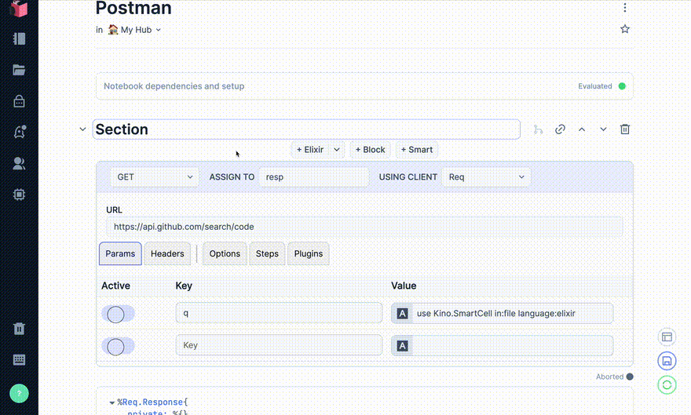

# Merquery



Merquery currently consists of 2 components:

* `Merquery` Smart Cell that provides an interactive way to work with HTTP requests, akin to Postman
* A `mix` task -- `mix merquery.generate` -- which introspects on your router and generates
`Merquery` smart cells pre-filled with the information relevant to each route.

`Merquery` takes advantage of the Livebook ecosystem to have built in support for serialization 
and secret storage, so you can save queries for later usage and use keys from your Livebook 
Hub token vault.

It also can be used to generate source code just as all Smart Cells do. You can use `Merquery`
as a learning tool to learn how to use Elixir HTTP clients.

## Installation

The package can be installed
by adding `merquery` to your list of dependencies in `mix.exs`:

```elixir
def deps do
  [
    {:merquery, "~> 0.1.0"}
  ]
end
```

Due to how early in development this project is, I recommend you instead install via
GitHub, since I am currently unsure how often I will publish Hex releases:

```elixir
def deps do
  [
    {:merquery, github: "acalejos/merquery"}
  ]
end
```

## Roadmap

Currently this is just a fun project I am working on and this roadmap is subject to change.
You may submit feature requests in the form of a GitHub issue.

These are just some ideas for features I currently have, but are subject to change:

- [ ] Finish basic REST operations support
- [ ] Registering custom plugins
- [ ] Improve `mix merquery.generate`
  - [X] Allow customized parameters for routes, etc. 
  - [ ] Add Table of Contents at Top
- [ ] Migrate to TailwindCSS and distinctive design palette
- [ ] Req plugin discoverability - Host a location where Req plugins can be submitted for others to 
discover for use with `Merquery` 
- [ ] Livebook routes instant deploy - Have a mix task (e.g. `mix merquery.deploy`) to automatically
deploy the generated livebook from `mix merquery.generate`
- [ ] ~~Support other HTTP clients and their unique features (HTTPoison, Tesla, etc. )~~ *(EDIT: Forgoing the idea of pluggable clients and instead focusing entirely on Req)*
- [ ] Move Vue to Composition API and breakout components to SPCs
